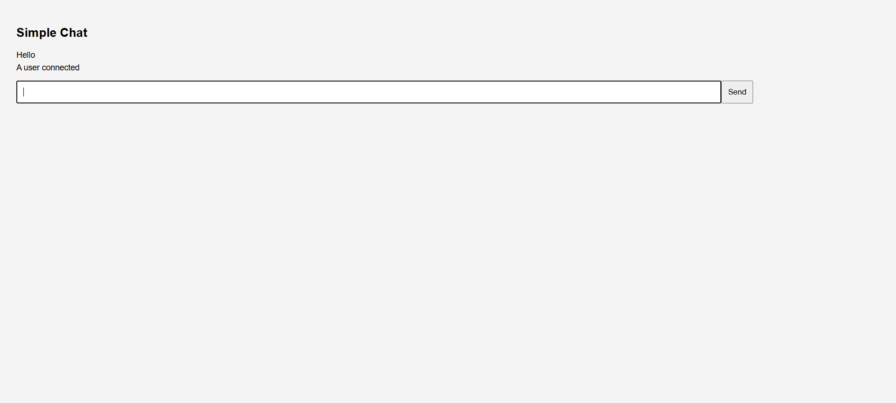
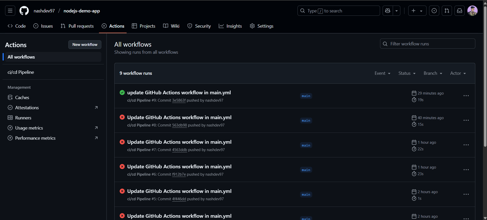
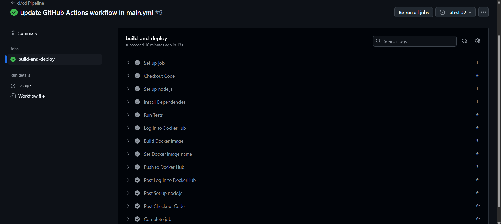

# 🗨️ Node.js Chat App with CI/CD

A simple real-time chat application built using **Node.js**, **Express**, and **Socket.io**.  
Includes automated CI/CD using **GitHub Actions** and **DockerHub**.

---

## 🚀 Features

- Real-time messaging between multiple clients
- Lightweight and fast with Express + Socket.io
- CI/CD pipeline with GitHub Actions
- Dockerized deployment to DockerHub

---

## 📦 Tech Stack

- Node.js
- Express
- Socket.io
- Docker
- GitHub Actions

---

## 🖥️ Demo

Clone and run locally:

bash:
git clone https://github.com/your-username/nodejs-demo-app.git
cd nodejs-demo-app
npm install
node app.js

Then open http://localhost:3000
Open in multiple tabs or devices to chat in real time.

🐳 Docker

Build and run locally:
bash:
docker build -t nodejs-demo-app .
docker run -p 3000:3000 nodejs-demo-app

🔁 CI/CD Pipeline

GitHub Actions automatically:

Runs tests

Builds a Docker image

Pushes to DockerHub on every push to main

🛠️ Setup Instructions
Create a DockerHub repo (e.g., nodejs-demo-app)

In your GitHub repo settings → Secrets and Variables → Actions, add:

DOCKER_USERNAME: your DockerHub username

DOCKER_TOKEN: a DockerHub access token, not password

Make sure your .github/workflows/main.yml includes:

- name: Build Docker Image
  run: docker build -t ${{ secrets.DOCKER_USERNAME }}/nodejs-demo-app .

- name: Push Docker Image
  run: docker push ${{ secrets.DOCKER_USERNAME }}/nodejs-demo-app

📁 File Structure

.
├── app.js               # Main Node.js app
├── index.html           # Chat UI served at root
├── Dockerfile           # Docker config
├── package.json         # Node dependencies & scripts
└── .github/workflows/
    └── main.yml         # CI/CD pipeline

📃 License
MIT License. Free to use and modify ✨

🤝 Contributing
Pull requests welcome! Feel free to fork the repo and submit changes.

🔗 Links
Express.js

Socket.io

GitHub Actions Docs

DockerHub

📷 Screenshots

